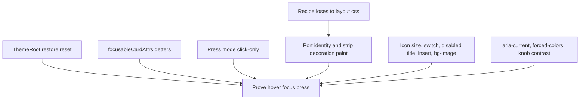
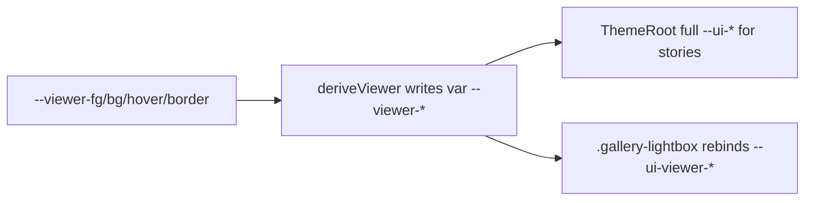

# Gallery design system refactoring plan

Status: review High items and the visual follow-up are done. The remaining work is residual verification and a few identity leftovers (Glass chip token, press-in-browser, ThemeMatrix coverage). The original Cartoon/cascade failures below are the pre-refactor diagnosis — they are closed by the primitives, not still open.

## Review follow-up

Persist Sol and Fable findings here so later sessions do not rediscover them. Close items in place; do not delete the record.



### Shared High

| Item | Reviewers | Problem | Fix |
| --- | --- | --- | --- |
| Recipe vs consumer `css` | both | Done. Geometry/size live in `:where()`; ControlStates asserts a 24px `IconButton`. |
| `focusableCardAttrs` | both | Done. Accepts `string \| (() => string)`; GridImage/ImageList pass getters. |
| Document reset | both | Done. `ThemeRoot` scopes box-sizing, heading margins, and raw `button` font/cursor. |

### Sol High

| Item | Problem | Fix |
| --- | --- | --- |
| Press activation | Done. Click-only events activate; only the post-mousedown click is swallowed. |
| Decoration rest/selected paint | Done. Overlay rest lives in `ControlTheme.overlay`. Boundary test flags rest paint on control hooks; chrome uses `:not([data-ui])`. |

### Fable High

| Item | Problem | Fix |
| --- | --- | --- |
| Theme identity | Done for the listed looks: Retro bevels + dark FAR, Minimal underline, Glass pills, Cartoon borderless quiet, Polaroid nav/filmstrip, Terminal tracking. Glass expanded chip is still not a token. |

### Medium — recipe and a11y

| Item | Reviewers | Fix |
| --- | --- | --- |
| Icons shrink to `1em` of the losing font-size | Fable | Done. `--_icon-size` plus `:where()` so consumer `font-size` / width wins. |
| Recipe inserted in `ref` | Fable | Done. Recipe and fonts bind at module evaluation; `ref` still refreshes for HMR. |
| Switch knob ignores `--_border-width` | Fable | Done. Inset and travel use border width and a fitted knob. |
| `:disabled { pointer-events: none }` | Fable | Done. Removed. |
| `background-image: none` | Sol | Done. Optional `ControlPaint.image`. |
| Filmstrip `aria-pressed` | both | Done. `selection="current"` emits `aria-current`. |
| Light-theme switch knobs | Sol | Done. Unchecked knob is `--text-primary`. |
| `forced-color-adjust: none` | both | Done. Forced-colors uses system colors. |
| Tests do not prove interaction | both | Partial. Focus now requires a visible outline. Hover still uses Playwright `:hover`. Press-in-browser is not driven (`page.mouse` is unavailable). Matrix still covers choice + selected only. |

### Visual follow-up (closed)

| Item | Fix |
| --- | --- |
| Settings row air | ThemeRoot heading reset is `:where(h1…)`. SectionTitle keeps 20/10. Switch rows `12px 0`. Cartoon aside and Obsidian chips add pack padding. |
| Filmstrip radius | Viewer `ChoiceButton` clips with `overflow: hidden`; the image uses `border-radius: inherit`. Cartoon/Paper echo that. |

### Viewer tokens (closed)

Custom properties inherit the *computed* value. `--ui-viewer-*-bg: var(--overlay-control)` on ThemeRoot became a hex, so `.gallery-lightbox { --overlay-control: … }` never retinted `[data-ui]` buttons. Blueprint light then painted `--text-primary` (navy) on `--overlay-control` (navy).



| Rule | Where |
| --- | --- |
| Required pair, both modes | `--viewer-fg`, `--viewer-bg`, `--viewer-bg-hover`, `--viewer-border` in `DECORATIVE_TOKEN_KEYS` |
| `deriveViewer` | Reads only those vars. Overlay stays `--overlay-control`. Retro mode fn is the escape hatch, not the system. |
| Host binding | `resolveViewerControlCssVars` on `.gallery-lightbox`. ThemeRoot still sets the full set for stories. |
| Dark-stage default | White ink on `var(--overlay-control)`. |
| Blueprint light | Navy ink on `#234f9b0c` / `#234f9b20`. No viewer paint override. No decoration rewrite of `--overlay-control`. |
| Stories | `StoryWrapper` writes `themePack` / `themeMode` when pack or mode is passed, because the lightbox host reads those atoms. |

### Medium / Low — keep on the list

- `onBefore` on keyboard is acceptable (show lightbox chrome). Add press-mode click-only, disabled, and `stopPropagation: false` cases.
- `sm`/`lg` only override CSS variables inside `:where()`.
- Boundary raw-button check still uses a substring; FolderTree expand stays the documented exception.
- Residual: coarse-pointer / reduced-motion / forced-colors untested in browser; `ThemeMatrix` mounts many `GlassFilters`; `ControlStates` shares module atoms; VisualReference baselines not recaptured; leftover optional tokens and three `ThemePack` lists.
- Closed here: `title` only when passed or `size="icon"`; `getThemeDefinition` has no paper fallback; optional decorative vars clear on pack switch.

Do not reopen settled constraints: stay in `examples/gallery`; Reatom JSX mounts once; FolderTree expand may stay a raw button; preferences must not import the registry; press must not set `transform`.

## Outcome

Every enabled control must have visible hover, keyboard focus, and press feedback in every theme, including when selected. Adding a theme should mean supplying a complete visual definition, without reimplementing interaction states throughout the app.

Keep Reatom JSX, the existing theme identities, saved preferences, and gallery behavior. Start inside `examples/gallery`; do not introduce a new styling framework or shared workspace package during this refactor.

## Original failures (pre-refactor)

Diagnosis from the source before primitives landed, including the Cartoon addition. Closed by the control recipe, typed tokens, and the viewer pair above. Kept so later sessions do not rediscover the same cascade bugs.

| Evidence                                                                                                                                                                      | Failure mechanism                                                                                                                                                                                                                                                 | Architectural consequence                                                                                      |
| ----------------------------------------------------------------------------------------------------------------------------------------------------------------------------- | ----------------------------------------------------------------------------------------------------------------------------------------------------------------------------------------------------------------------------------------------------------------- | -------------------------------------------------------------------------------------------------------------- |
| [`SettingsPanel.tsx`](../src/components/SettingsPanel.tsx), `OptionButton`; [`CartoonTheme.ts`](../src/components/CartoonTheme.ts), `common`                                  | An option's hover changes only border and foreground to `--accent`. Cartoon makes `--accent`, `--border`, and `--text-primary` the same color. Hover exists in CSS but changes nothing visible.                                                                   | Theme tokens must describe distinct control states; a generic accent cannot guarantee feedback.                |
| [`Lightbox.tsx`](../src/components/Lightbox.tsx), `controlBtnCss` and `navBtnCss`; Cartoon's `.gallery-lightbox` overrides                                                    | Shared hover changes `background`, but the more specific theme descendant selectors set a constant white background. The theme's normal styling wins over the control's hover styling. Navigation opacity may still change; background feedback is masked.        | Themes must not override state-owned properties with structural selectors.                                     |
| `SettingsPanel.tsx`, `ToggleSwitch`, `ThemeModeButton`, `ThemePackButton`                                                                                                     | Switches have no hover rule. Option and theme buttons implement selected states separately; selected rules can supersede hover at equal specificity. Not every Settings button lacks feedback: unselected theme cards and mode buttons already change background. | Define combined selected/hover/press states once instead of treating a `:hover` rule as sufficient.            |
| [`Toolbar.tsx`](../src/components/Toolbar.tsx), [`SortPanel.tsx`](../src/components/SortPanel.tsx), [`Slideshow.tsx`](../src/components/Slideshow.tsx), Settings and Lightbox | Each repeats its own control CSS. Persistent selection is expressed with `data-active`, `aria-pressed`, or `data-on`; transient press is a different concept.                                                                                                     | Common primitives must own semantics and state styling, with feature code supplying values and actions.        |
| [`theme.tsx`](../src/theme.tsx), `ThemeVariables`                                                                                                                             | `Record<\`--${string}\`, string>` accepts arbitrary names and omissions. It does not enforce required hover or selected-hover tokens, or detect aliases that resolve to identical colors.                                                                         | Use a finite typed token contract plus rendered-state verification. Types alone cannot prove visible feedback. |
| [`AppShell.tsx`](../src/components/AppShell.tsx) versus [`StoryWrapper.tsx`](../src/shared/StoryWrapper.tsx)                                                                  | The app includes theme detail CSS and Cartoon's font definition. Component stories apply theme variables and `GlobalStyles`, but omit those app-shell theme rules.                                                                                                | Isolated stories must use the production theme boundary to expose cascade regressions.                         |
| [`SettingsPanel.stories.tsx`](../src/components/SettingsPanel.stories.tsx) and [`Lightbox.stories.tsx`](../src/components/Lightbox.stories.tsx)                               | Existing stories cover opening panels, image decoding, and navigation, not a theme-by-state visual contract. The initial Cartoon verification likewise covered rendering and clicks without hover checks.                                                         | Add targeted real-browser state checks and visual review to the definition of a complete theme.                |

## Target ownership

```text
Feature components        → layout, domain actions, reactive values
Control primitives        → native semantics, events, complete state recipes
Theme boundary + registry → resolved tokens, fonts, decorative materials
Storybook                 → same boundary + primitives + real feature contexts
```

### 1. One theme boundary, shared with stories

Extract `ThemeRoot` from the styling responsibilities of `AppShell`. It owns theme/mode attributes, resolved variables, required styles, fonts, and scoped material setup. `AppShell` keeps gallery layout and feature content. `StoryWrapper` uses `ThemeRoot` with its own layout instead of maintaining a partial copy of theme setup.

`ThemeRoot` accepts explicit pack/mode for stories. `StoryWrapper` also writes the preference atoms when those props are set, because lightbox viewer vars resolve from `themePack` / `resolvedThemeMode`. Isolated specimens therefore share the last story's pack on the Storybook origin. Bind persisted atoms at the app boundary. Keep fonts and static styles registered predictably across mount/unmount and HMR. Separate document resets from instance-scoped styles.

Preserve Glass's surface binding and optical resources under an explicit material lifecycle. Do not require mounting the whole gallery or starting image loaders to render a button story.

### 2. Typed, complete control tokens

Create a finite `ControlTheme` contract for the control roles actually needed: ordinary action, quiet action, choice, and switch. Treat icon-only presentation as a size/content option, not an independent state implementation. Theme preview cards compose the choice primitive with swatches and text.

Each role resolves a complete palette for both normal UI and viewer surfaces. A light theme can still have a dark lightbox. Viewer paints come from the required `--viewer-*` pair, not from `--overlay-control` and not from a per-pack paint table. Bind `--ui-viewer-*` on the viewer host so `var(--viewer-bg)` substitutes in-sheet.

Required resolved values include foreground, background, border and shadow for rest, hover, press, selected, selected-hover, selected-press, and disabled states; also focus outline color/width/offset, geometry, typography, and motion. Switches cover both checked and unchecked interaction states. Variants can share a recipe or inherit a validated base, but the final resolved definition must be complete. Partial overrides are authoring convenience, not the exported contract.

Use `satisfies` against the finite types and one resolver to produce CSS variables. Keep arbitrary decorative properties separate from the required control contract. Validate required values for every registered pack and mode. Do not invent unused variants or a general-purpose token compiler.

Consolidate theme metadata, palettes, fonts, and decoration exports into a registry. Derive picker options and accepted preference values from it where practical; preserve current IDs, default values, local-storage keys, and legacy snapshot migrations.

### 3. Shared Reatom JSX control primitives

Start with `Button`, `IconButton`, `ChoiceButton`, and `Switch`. A single internal control recipe supplies common feedback; wrappers provide the appropriate semantics and content. Extract shared fields and panels after the button migration proves this boundary.

Feature consumers supply action callbacks, reactive selected/checked/disabled values, accessible labels, size, appearance, and surface context. They do not supply hover colors or copy interaction selectors. Keep reactive getters attached to DOM props; Reatom JSX components run once at mount, so do not snapshot a changing boolean during component construction. Continue using native `on:*` bindings for Reatom event context. Icon content must be created for each instance, never reuse a mounted JSX node.

Use `aria-pressed` for toggle buttons, `role="switch"` with `aria-checked` for switches, and native disabled semantics where appropriate. Do not conflate persistent selection with CSS `:active`. Any styling-only state attribute must be derived internally from the same reactive source as its semantic attribute. Icon buttons require an accessible name and icons must not shrink when padding changes.

Preserve existing activation behavior explicitly. [`pressEvents.ts`](../src/components/pressEvents.ts) activates some lightbox controls on mouse down, suppresses the following click, and handles keyboard activation. Keep that behavior behind a reviewed control adapter during migration; test single activation, propagation, keyboard operation, touch, and disabled guards. Changing activation timing is a separate behavior change, not an incidental consequence of replacing markup.

### 4. Make cascade ownership enforceable

The shared recipe alone assigns control foreground, background, border, shadow, and interaction feedback. Theme definitions supply variables; theme decoration CSS may style paper, halftone, glass, frames, and noninteractive pseudo-elements, but cannot directly restyle descendant controls or their states.

Use stable component hooks such as `data-ui="button"` and explicit variants. Retire hooks named after a particular theme (`glass-lens`, `data-glass-toggle`) from the public control contract. Preserve necessary material integration through explicit primitive hooks, then remove the compatibility aliases.

Keep state rules in one predictable stylesheet/recipe with modest specificity. Do not fix conflicts by adding `!important` or more ancestor selectors. CSS layers may help during migration, but introducing them only around new controls is insufficient: existing unlayered overrides must be removed or isolated when each consumer migrates.

Apply these state rules centrally:

- Disabled controls suppress hover/press feedback and activation.
- Selected controls retain selection while showing distinct hover/press feedback.
- Keyboard focus is an additive outline, visible alongside every enabled state; shadow changes cannot erase it.
- Hover feedback is gated to hover-capable pointers. Touch receives press feedback without requiring hover.
- Reduced motion removes movement, not all feedback. Forced colors retains visible boundaries and focus.
- Decorations never intercept input. Press effects must not overwrite positioning transforms such as lightbox navigation's vertical centering.

## Migration sequence and exit criteria

Keep each stage independently reviewable. Migrate a consumer and remove its competing legacy selectors in the same change; avoid a permanent second styling system.

1. **Capture the failures in browser stories.** Done. Cartoon light/dark Settings and lightbox control stories exist. Hover still uses Playwright `:hover`; press-in-browser is open.
2. **Unify theme rendering.** Done. `ThemeRoot` is the app and story boundary.
3. **Introduce the control contract and primitives.** Done. Registry asserts every pack/mode. Viewer pair is required; Blueprint light wash is tested.
4. **Migrate Settings first.** Done.
5. **Migrate Lightbox and Slideshow.** Done. Viewer host rebinds `--ui-viewer-*`.
6. **Migrate remaining gallery controls.** Done for Toolbar, Sort, Filter, grid/list/table, folders, details. Search/number fields were out of the first primitive set.
7. **Close the architectural escape routes.** Partial. Boundary test is still a substring. Glass `--liquid-control` is still a decoration token, not a control token. Contributing restates the cascade rule.

## Verification strategy

Use the existing Storybook/Vitest browser infrastructure. A successful build or unit test cannot verify pseudo-classes or CSS precedence.

| Coverage                | Required evidence                                                                                                                                                                                                                                               |
| ----------------------- | --------------------------------------------------------------------------------------------------------------------------------------------------------------------------------------------------------------------------------------------------------------- |
| Token contract          | All registered themes resolve both modes and both surface contexts; required state values are present. Type checking catches missing fields; runtime checks catch missing/invalid resolved values.                                                              |
| Shared primitives       | Mouse hover, pointer press/release, keyboard focus, selection plus hover/press, checked/unchecked switches, disabled non-activation, and exactly one callback per activation.                                                                                   |
| Theme matrix            | Generate cases from the registry for every theme/mode/control role on ordinary and viewer surfaces. New themes automatically join coverage.                                                                                                                     |
| Visual distinction      | Compare relevant computed paint properties before/after real interaction and review focused screenshots. Resolve aliases in the browser. String inequality of token values is insufficient, and property inequality alone is not proof of perceptible feedback. |
| Real contexts           | Settings and lightbox integration stories use the production boundary and catch ancestor overrides, clipping, focus loss, auto-hide behavior, and interaction propagation.                                                                                      |
| Accessibility and input | Existing accessibility checks plus keyboard traversal and focus visibility; coarse-pointer/touch, reduced-motion, and forced-colors cases for the shared recipe. No hover-only access to commands.                                                              |
| Regression protection   | Existing gallery interaction/navigation tests remain green. Stabilize fonts, animation, pointer position, viewport, and fixtures before screenshot capture. Keep image decoding tests separate.                                                                 |

Do not take a full-app screenshot for every combination. Run inexpensive state checks across the registry, then use small component crops for theme approval and a few integration screenshots for layout/cascade risks. Synthetic specimen states may help designers inspect all states at once, but do not replace real pointer/keyboard tests. Include a reverse-mount-order story to expose accidental stylesheet insertion-order dependence.

Use the existing commands as the validation baseline: `pnpm --filter gallery build`, `pnpm --filter gallery exec tsc --noEmit`, and targeted `pnpm --filter gallery exec vitest run --project=storybook` stories. Resolve or report pre-existing check failures separately from regressions introduced by each migration stage.

## Proposed file layout

```text
src/design-system/
  ThemeRoot.tsx
  themeTypes.ts
  themes/registry.ts
  themes/<pack>.ts
  controls/controlStyles.ts
  controls/Button.tsx
  controls/IconButton.tsx
  controls/ChoiceButton.tsx
  controls/Switch.tsx
  controls/activation.ts
  controls/ControlStates.stories.tsx
  themes/ThemeMatrix.stories.tsx
```

Theme decorations can remain in their current files until their consumers migrate; move them without rewriting unrelated designs. The admin package already has a [`design-system/Button.tsx`](../../../packages/admin/src/view/design-system/Button.tsx); inspect it for useful conventions, but do not make this example depend on admin internals. Consider a shared package only after both consumers demonstrate compatible requirements.

## Definition of done

A new gallery theme is accepted through a typed registration with complete resolved states and automatically included visual checks. Settings and lightbox consume the same primitives as the rest of the gallery. Stories render the same theme implementation as production. Feature and decoration files no longer compete with the control recipe for interaction styling. The original Cartoon failures are retained as regression cases, and all existing themes retain their visual identity and behavior.
