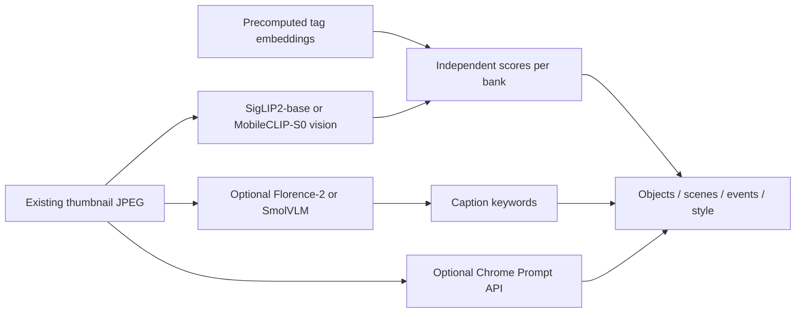

# In-browser image tagging — research findings

Status: research only (2026-09-19). No implementation.

## TL;DR

There is no single model that is both **SOTA photo tagging** and **tiny**. The Pareto front for this local-first gallery:

| Goal                                 | Stack                                                                                                                                                                          |                                     First download | Proven in a page?                                                                                                                                                                |
| ------------------------------------ | ------------------------------------------------------------------------------------------------------------------------------------------------------------------------------ | -------------------------------------------------: | -------------------------------------------------------------------------------------------------------------------------------------------------------------------------------- |
| **Best advanced-and-light default**  | **SigLIP2-base vision-only** (`q4` / `q4f16`) + precomputed [LibrePhotos 938-tag](https://github.com/LibrePhotos/librephotos/blob/dev/apps/backend/service/tags/tags.txt) bank | **~63–55 MB** vision + **~2 MB** embeds + ORT WASM | Encoder yes (transformers.js `siglip`). No dedicated SigLIP2 WebGPU Space                                                                                                        |
| **Lightest useful open-vocab path**  | **MobileCLIP-S0** vision `quantized` + same tag bank                                                                                                                           |                                  **~12 MB** vision | Yes — [Xenova/webgpu-mobileclip](https://huggingface.co/spaces/Xenova/webgpu-mobileclip)                                                                                         |
| **Richest _dedicated_ tagger**       | RAM++ INT8, 4,585 everyday tags                                                                                                                                                |                                         **873 MB** | Community ONNX only. **No browser demo**                                                                                                                                         |
| **Open captions / extra phrases**    | Florence-2-base-ft **or** SmolVLM-256M (idle / lightbox)                                                                                                                       |                                    **~264–333 MB** | Yes — [florence2-webgpu](https://huggingface.co/spaces/Xenova/florence2-webgpu), [SmolVLM-256M-WebGPU](https://huggingface.co/spaces/HuggingFaceTB/SmolVLM-256M-Instruct-WebGPU) |
| **Zero extra model in _our_ bundle** | Chrome **Prompt API** (Gemini Nano) + JSON `{ tags: string[] }`                                                                                                                |                                    browser-managed | Shipped **Chrome 148+** desktop. Not in workers. Hardware-gated                                                                                                                  |

**Do not** use ImageNet CNNs (MediaPipe EfficientNet, MobileNetV4) as the primary tagger — 1,000 ImageNet classes are not a photo library. **Do not** use WD14 / JoyTag / Camie (Danbooru). **Do not** download SigLIP2’s text tower (1.13 GB fp32) into the app.

Hook: existing thumbnail JPEG / `ImageBitmap`, own worker, persist like `favorite`. Stay off the `img.decode()` lane.

---

## 1. Gallery constraints that decide the stack

The app is local-files only (`showDirectoryPicker`, File System Access). Bytes never leave the machine. There is **no** ONNX / TF.js / CLIP / WebGPU inference today.

| Constraint                                                           | Implication                                            |
| -------------------------------------------------------------------- | ------------------------------------------------------ |
| Thumbnails already exist (192–2048 long edge, JPEG blob URLs)        | Classify **thumbs**, never re-decode originals         |
| `img.decode()` is serialized to **1**; bitmap lane is 2 jobs / 32 MP | New work belongs in a **separate worker**              |
| COOP/COEP already on (libraw-wasm / SharedArrayBuffer)               | Threaded ORT WASM is available                         |
| Live libraries are unbounded; CI corpus is 95 fixtures               | Idle queue, persist tags, tolerate thousands of images |
| Favorites are `withLocalStorage('gallery.favorite.${relativePath}')` | Same slot for `tags` on `GalleryImageModel`            |
| Filters are filename / extension / size / subfolders                 | Tag filter + search-in-tags belong in `filters.ts`     |
| Info panel is lightbox-only                                          | Show chips there first; grid overlay later             |

Natural attach point: `models/image.ts` next to `favorite`, then `matchesVisibleFilters`, `FilterPanel`, `ImageInfoPanel`.

---

## 2. Three tagging methods (only one is both rich and light)

| Method                           | How                                            | Richness                                | Browser reality                                             |
| -------------------------------- | ---------------------------------------------- | --------------------------------------- | ----------------------------------------------------------- |
| Closed-set CNN                   | Softmax over ImageNet-1k / COCO-80 / Places365 | Thin                                    | Tiny (5–23 MB). Wrong ontology for a gallery                |
| **Zero-shot encoder × tag bank** | One image embed, score a frozen list           | As good as the list                     | **The deployable path.** 12–63 MB vision                    |
| Dedicated multi-label (RAM++)    | One pass, 4,585 independent sigmoids           | Best everyday density                   | 0.87–1.86 GB. Unproven in `onnxruntime-web`                 |
| Caption VLM then parse           | Autoregressive text                            | Fluent, unsystematic                    | 260–520 MB. Use idle / selected photo                       |
| Chrome Prompt API                | On-device Gemini Nano                          | Open vocab, unstructured unless schemed | **No model in our bundle.** Chrome-only, not for bulk index |

RAM / RAM++ papers beat CLIP/BLIP on tagging. They are the quality ceiling, not a first ship. There is still **no** Open Images / ML-Decoder / TResNet multi-label ONNX on the Hub (checked 2026-09-19).

CLIP-style `zero-shot-image-classification` demos **softmax** a handful of labels. For “all possible tags”, encode the image once and score banks **independently** (dot / sigmoid + threshold). LibrePhotos softmaxes their 938-list because raw CLIP cosine sits at ~0.2–0.3; copy their `a photo of {tag}` prompt if using CLIP/MobileCLIP. For SigLIP/SigLIP2, sigmoid calibration is the native multi-label math.

---

## 3. Ranked options for this repo

### 3.1 Default: SigLIP2-base vision + LibrePhotos bank

- **IDs:** [`onnx-community/siglip2-base-patch16-224-ONNX`](https://huggingface.co/onnx-community/siglip2-base-patch16-224-ONNX) (Hub `model_type` is `siglip`; transformers.js has no separate SigLIP2 class)
- **Why:** 2025 WebLI encoder, Apache-2.0, transformers.js 4.x path, one forward pass, open vocab you control
- **Measured Hub bytes:**

  | File                                                  |         Bytes |
  | ----------------------------------------------------- | ------------: |
  | `onnx/vision_model_q4f16.onnx`                        |    54,630,849 |
  | `onnx/vision_model_q4.onnx`                           |    63,267,466 |
  | `onnx/vision_model_quantized.onnx`                    |    94,553,333 |
  | `onnx/text_model.onnx` (do **not** ship)              | 1,129,469,657 |
  | `tokenizer.json` (unneeded if embeds are precomputed) |    34,363,039 |

- **Runtime:** `@huggingface/transformers` **4.3.0** (npm 2026-09-16) on ONNX Runtime Web, `device: 'webgpu'` / WASM `q8`
- **Tag list:** [LibrePhotos `tags.txt`](https://raw.githubusercontent.com/LibrePhotos/librephotos/dev/apps/backend/service/tags/tags.txt) — **938** personal-photo labels (people, pets, food, scenes, weather, events, documents, `golden hour`, `bokeh`, `receipt`). LibrePhotos already scores this list with MobileCLIP-S2 / SigLIP2 on the server
- **Embed cache:** 938 × 768-d fp32 ≈ **2.9 MB** (SigLIP-base). 4k tags × 768-d ≈ 12 MB. Image encode is the cost; the dots are free
- **Fallback encoder:** [`Xenova/siglip-base-patch16-224`](https://huggingface.co/Xenova/siglip-base-patch16-224) if SigLIP2 hits ORT quirks (text q8 is 111 MB vs SigLIP2 text q8 283 MB)

### 3.2 Ultra-light: MobileCLIP-S0

- **IDs:** [`Xenova/mobileclip_s0`](https://huggingface.co/Xenova/mobileclip_s0) (S2 if quality > size)
- **Measured:** vision fp32 45.5 MB, **vision quantized 11.8 MB**; text quantized 42.8 MB
- **Demo:** [Xenova/webgpu-mobileclip](https://huggingface.co/spaces/Xenova/webgpu-mobileclip) (static Space, running)
- **License:** Apple custom (notice required, **no patent grant**, not OSI). Example **code** can stay MIT; **do not vendor weights as MIT**. Runtime Hub download + LICENSE file
- LibrePhotos’ **default tagger is MobileCLIP-S2**, so this is the closest “known product” stack

### 3.3 Idle / lightbox caption (optional second pass)

| Model                                                                                                    | License                              |                                    Typical quantized bundle | Demo                                                                                                     |
| -------------------------------------------------------------------------------------------------------- | ------------------------------------ | ----------------------------------------------------------: | -------------------------------------------------------------------------------------------------------- |
| [`onnx-community/Florence-2-base-ft`](https://huggingface.co/onnx-community/Florence-2-base-ft)          | **MIT**                              | encoder+decoder+embed+vision **q4 ≈ 333 MB**, int8 ≈ 275 MB | [florence2-webgpu](https://huggingface.co/spaces/Xenova/florence2-webgpu)                                |
| [`HuggingFaceTB/SmolVLM-256M-Instruct`](https://huggingface.co/HuggingFaceTB/SmolVLM-256M-Instruct) ONNX | **Apache-2.0**                       |                                        q4 trio ≈ **264 MB** | [SmolVLM-256M-Instruct-WebGPU](https://huggingface.co/spaces/HuggingFaceTB/SmolVLM-256M-Instruct-WebGPU) |
| [`onnx-community/LFM2.5-VL-450M-ONNX`](https://huggingface.co/onnx-community/LFM2.5-VL-450M-ONNX)        | **LFM 1.0** ($10M commercial cutoff) |                                 q4 ≈ 365 MB, q4f16 ≈ 316 MB | [LFM2.5-VL-450M-WebGPU](https://huggingface.co/spaces/LiquidAI/LFM2.5-VL-450M-WebGPU)                    |

Florence-2 also does `<OD>` / `<DENSE_REGION_CAPTION>`. LFM2.5-VL is what LibrePhotos downloads for captions; **do not vendor** those weights into an MIT tree. Prefer Florence-2 or SmolVLM if the example must stay Apache/MIT-clean.

### 3.4 Chrome Prompt API (progressive enhancement)

[Prompt API](https://developer.chrome.com/docs/ai/prompt-api) (docs 2026-08-26):

- Web **shipped Chrome 148** (extensions 138). Sampling params are still origin-trial; the API is not
- `expectedInputs: [{ type: 'image' }]`, `ImageBitmap` / `Blob` / `OffscreenCanvas` accepted
- `responseConstraint` JSON Schema — official hashtag / tag-list pattern
- Hardware: desktop Win/macOS 13+/Linux/Chromebook Plus; **≥22 GB** free; GPU **>4 GB VRAM** _or_ 16 GB RAM + 4 cores
- **Not available in Web Workers**
- First origin downloads Gemini Nano (size via `chrome://on-device-internals`)

Use for the **open lightbox photo**, never as the library indexer.

### 3.5 Tiny closed-set (only as extras)

| Model                                                                                                                         |                     Size | Vocab          | Use                                                                                                                                                                        |
| ----------------------------------------------------------------------------------------------------------------------------- | -----------------------: | -------------- | -------------------------------------------------------------------------------------------------------------------------------------------------------------------------- |
| MediaPipe EfficientNet-Lite0 int8                                                                                             | **5.43 MB** + Tasks wasm | ImageNet-1000  | Skip as primary                                                                                                                                                            |
| [`onnx-community/mobilenetv4_conv_small…`](https://huggingface.co/onnx-community/mobilenetv4_conv_small.e2400_r224_in1k) int8 |                  3.93 MB | ImageNet-1000  | Same                                                                                                                                                                       |
| [`litert-community/Places365-ResNet18-LiteRT`](https://huggingface.co/litert-community/Places365-ResNet18-LiteRT) fp16        |              **22.8 MB** | 365 scenes     | Optional specialist. LiteRT.js 2.5.3 WebGPU **2.72 ms p50** on M4 Max ([card notes](https://github.com/john-rocky/edge-compat/blob/main/cards/places365-resnet18/CARD.md)) |
| MediaPipe EfficientDet-Lite0 int8                                                                                             |                   4.4 MB | COCO-80 boxes  | Optional “person / car / dog” instances                                                                                                                                    |
| MediaPipe Face Detector                                                                                                       |                    small | `faces: N`     | Tag only, no identity                                                                                                                                                      |
| NSFWJS                                                                                                                        |              ~2.6–3.5 MB | 5 NSFW classes | Optional safety flag                                                                                                                                                       |

`@mediapipe/tasks-vision` latest is **1.0.1**. Image Embedder is MobileNet similarity, **not** CLIP.

---

## 4. Runtime comparison

| Runtime                               | Role                                  | Notes                                                                                                                   |
| ------------------------------------- | ------------------------------------- | ----------------------------------------------------------------------------------------------------------------------- |
| **`@huggingface/transformers` 4.3.0** | **Default**                           | Pipelines + preprocess + WebGPU. Official worker tutorials. CLIP / SigLIP / MobileCLIP / Florence-2 / LFM2-VL / SmolVLM |
| **`onnxruntime-web` ~1.30–1.31**      | Under transformers.js; also raw RAM++ | WASM ~3 MB CPU / ~5 MB JSEP WebGPU. Full ops on WASM; WebGPU is a subset                                                |
| **MediaPipe Tasks Vision 1.0.1**      | Closed-set only                       | Best `ImageBitmap` ergonomics. GPU, not WebGPU. Classifier is ImageNet                                                  |
| **LiteRT.js 2.5.3**                   | Places365 / custom TFLite             | You pack NCHW. No CLIP pipeline. Wasm build ~9.3–9.6 MB                                                                 |
| **TF.js 4.22**                        | Legacy                                | Stale vs ORT / LiteRT. Skip for a new feature                                                                           |
| **WebNN**                             | Optional EP                           | Chrome/Edge **flag** only (2026-04 docs). Firefox/Safari: no production story                                           |
| **WebLLM / wllama**                   | VLMs                                  | Phi-3.5-vision ~2.8 GB; LFM2.5-VL via wllama ~322 MB. Heavier than transformers.js for the same idea                    |

WebGPU is the acceleration that matters (~85% global per HF March 2026). Gallery already has a secure isolated context.

---

## 5. Vocabulary (what “all possible tags” should mean)

There is **no** open Google Photos taxonomy. Immich does **embeddings + faces + OCR + user/XMP tags**, not ML auto-tags. PhotoPrism maps ImageNet through rules.

| List                            |            Count | Use                                                                    |
| ------------------------------- | ---------------: | ---------------------------------------------------------------------- |
| LibrePhotos `tags.txt`          |          **938** | **Always-on bank**                                                     |
| Places365                       |              365 | Already mostly inside LibrePhotos                                      |
| Open Images **boxable**         |              600 | Extra objects. Skip the 20,638 image-level names                       |
| COCO / Objects365 / LVIS        | 80 / 365 / 1,203 | Merge + synonym-collapse                                               |
| RAM `ram_tag_list.txt`          |            4,585 | Nouns only. Drops `bokeh` / `golden hour`; includes verbs and clip-art |
| CLIP Interrogator `flavors.txt` |          100,970 | **No** — SD prompt dump                                                |

**Ship 938 first.** If you grow a 3–4k bank, score **four softmax/threshold groups** (objects / scenes / events / style), not one 4k softmax.

Photo-style keep-list (hand-picked, not Interrogator): `golden hour`, `blue hour`, `bokeh`, `black and white`, `macro`, `long exposure`, `silhouette`, `natural light`, `film grain`, `lens flare`.

---

## 6. What not to use

| Option                                                       | Why                                                                                                                                          |
| ------------------------------------------------------------ | -------------------------------------------------------------------------------------------------------------------------------------------- |
| ViT / DeiT / MobileViT / FastViT / MobileNetV4 as the tagger | ImageNet-1k                                                                                                                                  |
| WD14, JoyTag, Camie, PixAI, cl_tagger                        | Danbooru (`1girl`, `solo`). Optional later for illustration folders only                                                                     |
| RAM++ in v1                                                  | 873 MB INT8, no browser proof                                                                                                                |
| Combined SigLIP2 `model.onnx` / text tower                   | 0.38–1.50 GB for no benefit if tags are pre-embedded                                                                                         |
| BLIP / BLIP-2                                                | No solid transformers.js path                                                                                                                |
| YOLO-World                                                   | Not a t.js model; GPL/AGPL                                                                                                                   |
| Jina CLIP v2                                                 | CC-BY-NC-4.0                                                                                                                                 |
| TinyCLIP                                                     | Too weak                                                                                                                                     |
| WebLLM vision                                                | Multi-GB                                                                                                                                     |
| ente / Immich / PhotoPrism web ML                            | Those products run ML **off** the web client (ente [explicitly](https://help.ente.io/photos/features/search-and-discovery/machine-learning)) |

---

## 7. Licenses vs this MIT example

| Weights                                                           | Can the example ship them?                                   |
| ----------------------------------------------------------------- | ------------------------------------------------------------ |
| SigLIP / SigLIP2, CLIP, Florence-2, SmolVLM, Places365, MobileNet | Yes (Apache-2.0 / MIT). Cache from Hub at runtime            |
| MobileCLIP                                                        | Runtime download + Apple LICENSE. Do not relicense weights   |
| LFM 1.0                                                           | Runtime download + notice. **Unlicensed above $10M revenue** |
| InsightFace (Immich/LibrePhotos faces)                            | Separate non-commercial terms — out of scope for tags        |

---

## 8. Suggested integration (when we implement)

1. Build-time script: encode LibrePhotos tags with SigLIP2 text (Node + transformers.js), write `tag-bank.bin` + `tags.json`.
2. Worker: load vision ONNX once; accept transferred `ImageBitmap` or thumbnail `Blob`; emit `{ label, score }[]`.
3. Idle queue after thumbnail ready; yield to `'high'` preview work (same idea as `previewLoad.ts`).
4. Persist `string[]` (and optional scores) keyed by `relativePath` in IDB (tag arrays are larger than a boolean favorite).
5. UI: lightbox `ImageInfoPanel` chips → filter/search → optional grid chips.
6. Later: Florence-2 / SmolVLM on the open photo; Prompt API when `LanguageModel.availability()` is `'available'`.
7. Measure laptop WebGPU / WASM ms on 224² thumbs before committing to SigLIP2 vs MobileCLIP-S0. Published in-browser tagger latencies are almost nonexistent.

---

## Sources

- Transformers.js: [docs](https://huggingface.co/docs/transformers.js/en/index), [WebGPU](https://huggingface.co/docs/transformers.js/en/guides/webgpu), [v4 blog](https://huggingface.co/blog/transformersjs-v4), npm `@huggingface/transformers@4.3.0`
- Models: Hub file lists for SigLIP2-ONNX, Xenova CLIP/SigLIP/MobileCLIP, Florence-2-base-ft, LFM2.5-VL-450M-ONNX, SmolVLM-256M-Instruct, RAM ONNX, Places365-ResNet18-LiteRT (bytes from Hub `lfs.size` / `size`, 2026-09-19)
- Demos: [webgpu-mobileclip](https://huggingface.co/spaces/Xenova/webgpu-mobileclip), [florence2-webgpu](https://huggingface.co/spaces/Xenova/florence2-webgpu), [LFM2.5-VL-450M-WebGPU](https://huggingface.co/spaces/LiquidAI/LFM2.5-VL-450M-WebGPU), [SmolVLM-256M-WebGPU](https://huggingface.co/spaces/HuggingFaceTB/SmolVLM-256M-Instruct-WebGPU)
- Chrome: [Prompt API](https://developer.chrome.com/docs/ai/prompt-api), [structured output](https://developer.chrome.com/docs/ai/structured-output-for-prompt-api)
- MediaPipe: [image classifier](https://ai.google.dev/edge/mediapipe/solutions/vision/image_classifier), npm `@mediapipe/tasks-vision@1.0.1`, EfficientNet-Lite0 int8 `5,434,517` B
- Products: [LibrePhotos `ml_models.py`](https://github.com/LibrePhotos/librephotos/blob/dev/apps/backend/api/ml_models.py) + [`tags.txt`](https://github.com/LibrePhotos/librephotos/blob/dev/apps/backend/service/tags/tags.txt); [Immich smart search](https://docs.immich.app/features/smart-search) / [tags](https://docs.immich.app/features/tags)
- RAM: [repo](https://github.com/xinyu1205/recognize-anything), [RAM++ paper](https://arxiv.org/abs/2310.15200), [INT8 ONNX](https://huggingface.co/anakhiu/ram-plus-onnx-int8)
- ORT Web: [deploy](https://onnxruntime.ai/docs/tutorials/web/deploy.html), [WebGPU EP](https://onnxruntime.ai/docs/tutorials/web/ep-webgpu.html)
- LiteRT.js: [web](https://ai.google.dev/edge/litert/web), `@litertjs/core@2.5.3`
